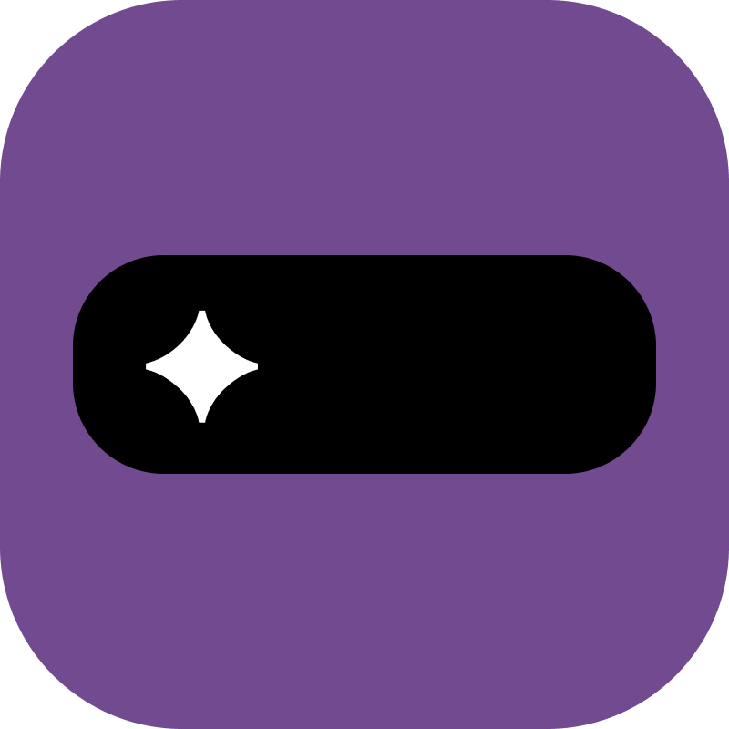

<p align="center">
  
</p>

<h1 align="center">Notchcode</h1>

<p align="center">
  An ambient monitor for Claude Code that lives in your MacBook's notch — Windows support coming soon.
  <br />
  <br />
  <a href="https://github.com/billxby/notchcode/releases/latest">
    
  </a>
  <a href="https://github.com/billxby/notchcode/releases">
    
  </a>
</p>

<p align="center">
  <video src="https://github.com/user-attachments/assets/014d7d49-12c2-4321-b85a-bc2490bc11a5" width="640" controls muted playsinline></video>
</p>

> **🟢 Actively maintained**
>
> v1.0.0 launched June 2026. Issues and PRs are reviewed — Windows support is in active development.

## Features

- **Notch UI** — at rest the overlay matches the hardware cutout exactly; it expands only when a session is live
- **Live session monitoring** — track multiple Claude Code sessions in real-time via hooks, with a file-watcher fallback
- **Jump to terminal** — when Claude is waiting on a permission prompt, one tap on the notch focuses the right terminal
- **Session drill-down** — tap a session to see its conversation history, live-tailed as it streams
- **Usage tracking** — exact local token counts with a weekly budget and a quiet "brake" warning before you hit it
- **Session lifecycle** — end sessions gracefully from the notch; crashed sessions are detected automatically
- **Auto hook setup** — additive, idempotent installer that never touches other tools' hooks
- **Works on non-notch Macs** — renders a virtual notch at menubar center on Airs, minis, and external displays

## Requirements

- macOS 13+
- [Claude Code](https://claude.com/claude-code) CLI

## Install

Download the latest signed & notarized DMG from [Releases](https://github.com/billxby/notchcode/releases/latest), or build from source:

```bash
git clone https://github.com/billxby/notchcode.git
open notchcode/mac/Notchcode/Notchcode.xcodeproj   # Xcode 16+, then ⌘R
```

On first launch, Notchcode offers to install its Claude Code hooks for you. Prefer to do it manually?

```bash
curl -fsSL https://raw.githubusercontent.com/billxby/notchcode/main/mac/Notchcode/Notchcode/Resources/install-hooks.sh | bash
```

## How It Works

Notchcode watches the session files Claude Code already writes to `~/.claude/projects/` and listens for hook events on a local loopback server (`127.0.0.1:9876`). Hooks give sub-second updates; the file watcher keeps everything working even without them.

Hooks are fire-and-forget: if Notchcode isn't running, they time out in under a second and Claude Code never notices.

## Privacy

Everything stays on your Mac. No analytics, no telemetry, no network calls beyond loopback.

## Roadmap

- 🚧 **Windows support** — in development right now (Tauri 2 + React/TS + Rust, notch-style top bar)
- **Themes & customization** — accent colors and prebuilt themes, community PR-driven
- **Quality of life** — session history search, markdown export, configurable auto-expand rules
- **Multi-monitor & power user** — choose your notch's display, keyboard shortcuts
- **Homebrew Cask**

## Contributing

Contributions are welcome! Open an issue or a PR — see [CONTRIBUTING.md](CONTRIBUTING.md) for setup and ground rules. The Windows port is the biggest open area, and themes are designed to be community-driven from the start.

## Credits

The notch overlay geometry is vendored from [DynamicNotchKit](https://github.com/MrKai77/DynamicNotchKit) by [MrKai77](https://github.com/MrKai77) — see [CREDITS.md](CREDITS.md).

## License

[MIT](LICENSE)
